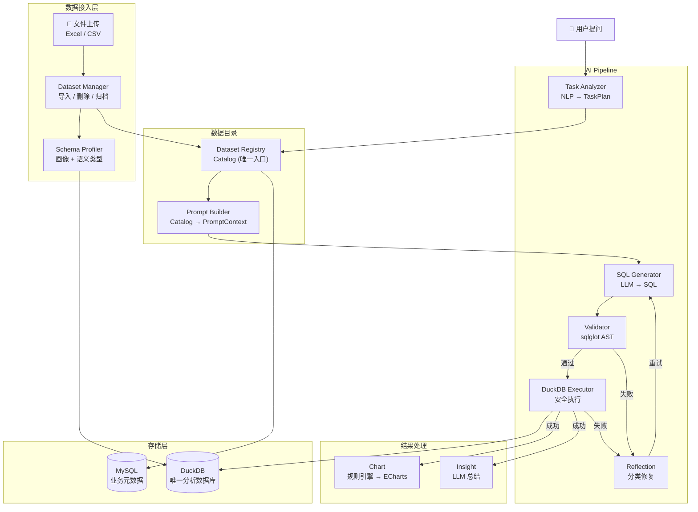

# AI Data Analyst

智能数据分析 Agent — 用自然语言提问，自动完成 SQL 生成、执行、可视化和业务洞察。

**核心理念：一套引擎，一个数据库，万物皆 Dataset。**



## Features

- **自然语言 → SQL** — 输入中文问题，自动生成 SQL 查询
- **万物皆 Dataset** — Excel、CSV、内置 Demo 统一抽象为 Dataset
- **数据画像** — 自动推断语义类型（dimension / measure / time / identifier）
- **PromptBuilder** — Catalog → PromptContext → Markdown，独立组装
- **统一分析引擎** — 所有查询走 DuckDB，AI 无需区分数据来源
- **结构化错误修复** — Error Classifier 分类处理，最多 3 次重试
- **多层安全防护** — sqlglot AST 校验 + 写操作阻断 + 运行时限
- **可视化** — 规则引擎自动选择图表（Line / Bar / Pie / Scatter / Histogram）
- **业务洞察** — LLM 总结查询结果
- **全链路可观测** — Trace ID 串联 + JSON 结构化日志

## Architecture

```
┌──────────────────────────────────────────────────────────┐
│                    AI Data Analyst                        │
├──────────────────────┬───────────────────────────────────┤
│   Business Database  │        Analytics Engine           │
│      (MySQL)         │           (DuckDB)                │
├──────────────────────┼───────────────────────────────────┤
│ users                │ orders          (Demo)            │
│ sessions             │ customers       (Demo)            │
│ messages             │ products        (Demo)            │
│ datasets             │ sales_june      (User Upload)     │
│                      │ finance_q2      (User Upload)     │
├──────────────────────┼───────────────────────────────────┤
│ AI 永远不查询         │ AI 只查询这里                     │
└──────────────────────┴───────────────────────────────────┘
```

| 层级 | 模块 | 职责 |
|------|------|------|
| **数据接入** | DatasetManager | Excel/CSV → DuckDB，导入 / 删除 / 归档 |
| **数据目录** | DatasetRegistry | Catalog 管理，AI 的唯一数据入口 |
| **画像** | SchemaProfiler | 列级统计 + 语义类型推断 |
| **Prompt** | PromptBuilder | Catalog → PromptContext → Markdown |
| **初始化** | Bootstrap | 系统启动、Demo 数据导入、组件装配 |
| **AI** | Task Analyzer | 理解用户意图 → `TaskPlan` |
| **AI** | SQL Generator | PromptBuilder 输出 + LLM → SQL |
| **安全** | Validator | sqlglot AST 校验，阻断写操作 |
| **执行** | DuckDB Executor | 安全执行，限 500 行 |
| **修复** | Reflection | Error Classifier → 分类重试 |
| **展示** | Chart | 特征分析 → 规则引擎 → ECharts |
| **洞察** | Insight | QueryResult → LLM → 业务总结 |

## Quick Start（5 分钟）

### 前置条件

- Docker & Docker Compose
- LLM API Key（[DeepSeek](https://platform.deepseek.com) / OpenAI）

### 步骤

```bash
# 1. 克隆
git clone https://github.com/yaox2689-max/t2sAnalysis.git
cd t2sAnalysis

# 2. 配置（唯一必须的步骤）
cp .env.example .env
# 编辑 .env，填入 LLM_API_KEY

# 3. 启动后端 + 数据库（自动建表 + 导入 Demo 数据）
docker compose up -d

# 4. 启动前端（另开终端）
cd frontend
npm install
npm run dev

# 5. 打开浏览器
open http://localhost:5173
```

启动后自动完成：
1. DuckDB 初始化（`analysis.duckdb`）
2. Demo 数据导入（Olist 电商数据集，8 张表）
3. DatasetRegistry 加载 Catalog
4. PromptBuilder 就绪
5. MySQL 业务表创建（sessions / messages / datasets）

### 验证

```bash
curl http://localhost:8000/health
# → {"status": "ok"}
```

## Local Development

```bash
# 方式 1: pip
cd backend
pip install -r requirements.txt
uvicorn main:app --reload

# 方式 2: uv
cd backend
uv pip install -e .
uv run uvicorn main:app --reload

# 前端（另开终端）
cd frontend
npm install
npm run dev
```

## Project Structure

```
├── backend/
│   ├── app/
│   │   ├── agents/              AI Pipeline
│   │   │   ├── sql_generator.py LLM → SQL（支持 PromptBuilder）
│   │   │   ├── reflection.py    Error Classifier + 修复策略
│   │   │   └── state.py         AgentState 统一 Context
│   │   ├── api/                 API 路由
│   │   │   ├── chat.py          聊天 API
│   │   │   └── datasets.py      文件上传 API
│   │   ├── core/                基础设施
│   │   │   ├── config.py        Pydantic Settings
│   │   │   ├── database.py      MySQL（业务元数据）
│   │   │   ├── duckdb.py        DuckDB（分析引擎）
│   │   │   ├── logging.py       JSON 结构化日志
│   │   │   └── prompt_loader.py Prompt 文件管理
│   │   ├── graph/               LangGraph StateGraph
│   │   │   ├── graph.py         图编排（支持 Registry + PromptBuilder）
│   │   │   ├── nodes.py         节点（新旧路径兼容）
│   │   │   └── routers.py       条件路由
│   │   ├── models/              Pydantic 契约
│   │   ├── services/            业务逻辑
│   │   │   ├── dataset_manager.py   Dataset 导入 / 删除 / 归档
│   │   │   ├── dataset_registry.py  Catalog 管理
│   │   │   ├── prompt_builder.py    PromptContext 组装
│   │   │   └── task_analyzer.py     NLP → TaskPlan
│   │   ├── tools/               工具函数
│   │   │   ├── chart.py         规则引擎 → ECharts
│   │   │   ├── column_cleaner.py 列名清洗
│   │   │   ├── duckdb_executor.py DuckDB 执行器
│   │   │   ├── insight.py       LLM 总结
│   │   │   ├── schema_profiler.py 数据画像 + 语义类型
│   │   │   └── sql_validator.py  AST 校验 + 写操作阻断
│   │   └── bootstrap.py         系统启动初始化
│   ├── prompts/                 Prompt 模板目录
│   ├── scripts/
│   │   ├── seed/                Demo CSV 数据
│   │   ├── schema.sql           Olist DDL
│   │   └── schema_datasets.sql  datasets 表 DDL
│   ├── tests/                   测试用例
│   ├── requirements.txt         pip 依赖
│   ├── pyproject.toml           uv / pytest 配置
│   └── main.py                  FastAPI 入口
├── frontend/
│   ├── src/
│   │   ├── pages/
│   │   │   ├── Chat.tsx         聊天页（拖拽上传 + 图表 + 洞察）
│   │   │   ├── History.tsx      历史会话
│   │   │   └── Settings.tsx     系统设置
│   │   └── services/api.ts      API 客户端
│   └── package.json
├── docker-compose.yml           开发环境
├── docker-compose.prod.yml      生产环境
└── .env.example                 环境变量模板
```

## Data Flow

### 上传流程

```
用户上传 Excel/CSV
        │
        ▼
  DatasetManager.import_file()
        │
        ├── Excel → pandas.read_excel → DuckDB
        ├── CSV   → DuckDB read_csv（直接读取）
        │
        ├── 列名清洗（中文 / 空名 / 特殊字符）
        ├── 表名生成（可读名 + UUID 后缀）
        │
        ├── SchemaProfiler → 数据画像（semantic_type）
        ├── 写入 MySQL datasets 表
        └── 注册到 DatasetRegistry
```

### 查询流程

```
用户提问
        │
        ▼
  DatasetRegistry.get_catalog(top_k=10)
        │
        ▼
  PromptBuilder.build_prompt(catalog)
  （注入 Schema + Profile + 语义类型 + 示例值）
        │
        ▼
  SQLGenerator → LLM 生成 SQL
        │
        ▼
  SQLValidator → sqlglot 校验
        │
        ▼
  DuckDBExecutor → 执行（写操作阻断）
        │
        ▼
  Chart + Insight → 返回前端
```

## Configuration

核心环境变量（`.env`）：

| 变量 | 必填 | 默认值 | 说明 |
|------|------|--------|------|
| `LLM_API_KEY` | ✅ | — | DeepSeek / OpenAI API Key |
| `LLM_MODEL` | — | `deepseek-chat` | 模型名称 |
| `LLM_BASE_URL` | — | `https://api.deepseek.com` | API 端点 |

完整变量见 [`.env.example`](.env.example)。

## API Endpoints

| 方法 | 路径 | 说明 |
|------|------|------|
| POST | `/api/chat` | 发送问题，返回 SQL + 图表 + 洞察 |
| POST | `/api/sessions` | 创建会话 |
| GET | `/api/sessions` | 列出会话 |
| GET | `/api/sessions/{id}` | 获取会话消息 |
| DELETE | `/api/sessions/{id}` | 删除会话 |
| POST | `/api/datasets/upload` | 上传 Excel/CSV 文件 |
| GET | `/api/datasets?session_id=` | 列出数据集 |
| DELETE | `/api/datasets/{table}` | 删除数据集 |
| GET | `/health` | 健康检查 |

## Tech Stack

| 层 | 技术 |
|---|------|
| Backend | FastAPI + Python 3.12 |
| Agent | LangGraph |
| LLM | DeepSeek / OpenAI |
| Analytics | **DuckDB**（唯一分析引擎） |
| Business DB | MySQL 8.0（元数据） |
| Frontend | React + Ant Design + ECharts |
| SQL Analysis | sqlglot |
| File Parsing | pandas（Excel）/ DuckDB（CSV） |
| Logging | JSON + Trace ID |

## Evaluation

```bash
cd backend
python -m evaluation.benchmark
```

| 指标 | 说明 |
|------|------|
| Task Accuracy | TaskPlan 与预期匹配度 |
| SQL Executable | SQL 是否可执行 |
| SQL Valid | 是否通过 AST 校验 |
| Result Consistency | 结果列是否符合预期 |

## FAQ

**Q: 支持哪些 LLM？**
A: 兼容 OpenAI API 格式的模型均可。默认 DeepSeek，修改 `LLM_BASE_URL` 和 `LLM_MODEL` 即可切换。

**Q: 支持哪些文件格式？**
A: `.xlsx`、`.xls`、`.csv`。Excel 默认导入所有 Sheet，每个 Sheet 生成独立数据集。

**Q: 上传的数据安全吗？**
A: 文件名 UUID 重命名存储，SQL 经 sqlglot 校验，写操作（INSERT/UPDATE/DELETE/DROP）被阻断。

**Q: Demo 数据和用户数据会混在一起吗？**
A: 对 AI 来说不会 — 它只看到 Catalog 中的表，不知道数据来源。数据在同一个 DuckDB 中共存。

**Q: 如何添加新的数据源（如 Parquet、API）？**
A: 在 DatasetManager 中新增 `import_parquet()` 方法，注册到 DatasetRegistry 即可。AI Pipeline 无需修改。

**Q: 需要 GPU 吗？**
A: 不需要。DuckDB 是嵌入式数据库，LLM 调用远程 API。

## License

MIT
