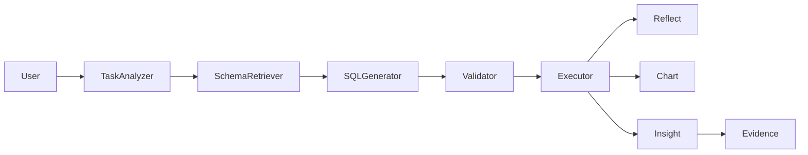

# AI Data Analyst

智能数据分析 Agent — 用自然语言提问，自动完成 SQL 生成、执行、可视化和业务洞察。



## Features

- **自然语言 → SQL** — 输入中文问题，自动生成 MySQL SELECT
- **智能 Schema 检索** — FAISS 向量检索 + 关键词匹配，而非全量 Schema
- **多层安全防护** — sqlglot AST 校验 + 只读用户 + 运行时超时
- **结构化错误修复** — Error Classifier 分类处理，最多 3 次重试
- **可视化** — 规则引擎自动选择图表类型（Line / Bar / Pie / Scatter / Histogram）
- **业务洞察** — LLM 总结查询结果
- **证据链分析** — 对比分析 + 多维交叉验证

## Quick Start（5 分钟）

### 前置条件

- Docker & Docker Compose
- LLM API Key（[DeepSeek](https://platform.deepseek.com) / OpenAI）

### 步骤

```bash
# 1. 克隆
git clone https://github.com/yaox2689-max/t2sAnalysis.git
cd t2sAnalysis

# 2. 配置环境变量
cp backend/.env.example backend/.env
# 编辑 backend/.env，填入 LLM_API_KEY

# 3. 启动
docker compose up --build

# 4. 打开浏览器
# http://localhost:5173
```

启动后系统自动完成：
1. MySQL 初始化（含 Olist 电商数据集）
2. FAISS Schema 索引构建
3. Backend API 启动（`:8000`）
4. Frontend 开发服务器（`:5173`）

### 验证

```bash
curl http://localhost:8000/health
# → {"status": "ok"}
```

## Configuration

核心环境变量（`backend/.env`）：

| 变量 | 必填 | 默认值 | 说明 |
|------|------|--------|------|
| `LLM_API_KEY` | ✅ | — | DeepSeek / OpenAI API Key |
| `LLM_MODEL` | — | `deepseek-chat` | 模型名称 |
| `LLM_BASE_URL` | — | `https://api.deepseek.com` | API 端点 |
| `DB_PASSWORD` | — | `root123` | MySQL 密码 |

完整变量见 `.env.example`。

## Project Structure

```
backend/
    agents/          Workflow 节点
    core/            基础设施（Config / Database / Redis / Logging）
    graph/           LangGraph StateGraph 编排
    repositories/    数据访问层
    schemas/         Schema 索引与检索
    services/        业务逻辑（TaskAnalyzer）
    tools/           Chart / Insight / Evidence / Validator / Executor
frontend/            React + Ant Design
evaluation/         Golden SQL + Benchmark
```

## Architecture

| 模块 | 职责 |
|------|------|
| Task Analyzer | NLP 理解 → TaskPlan |
| Schema Retriever | FAISS + 关键词 → SchemaContext |
| SQL Generator | LLM → GeneratedSQL |
| Validator | sqlglot AST → ValidationResult |
| Executor | 安全执行 → QueryResult |
| Reflection | Error Classifier → 分类修复 |
| Chart | 规则引擎 → ECharts Option |
| Insight | LLM 总结 → 业务洞察 |
| Evidence | 对比分析 → 证据链 |

## Production Deployment

```bash
docker compose -f docker-compose.prod.yml up --build
```

生产模式使用 Nginx 统一入口（`:80`），Frontend 为静态构建产物。

## Tech Stack

| 层 | 技术 |
|---|------|
| Backend | FastAPI + Python 3.12 |
| Agent | LangGraph |
| LLM | DeepSeek / OpenAI |
| Database | MySQL 8.0 |
| Vector Index | FAISS |
| Cache | Redis 7 |
| Frontend | React + Ant Design + ECharts |
| SQL Analysis | sqlglot |

## Development

```bash
# Backend（需要本地 Python 环境）
cd backend
pip install -r requirements.txt
uvicorn main:app --reload

# Frontend
cd frontend
npm install
npm run dev
```

## FAQ

**Q: 支持哪些 LLM？**
A: 兼容 OpenAI API 格式的模型均可。默认 DeepSeek，修改 `LLM_BASE_URL` 和 `LLM_MODEL` 即可切换。

**Q: 需要 GPU 吗？**
A: 不需要。Schema 检索使用 CPU FAISS，LLM 调用远程 API。

**Q: 支持多轮对话吗？**
A: 基础支持。TaskAnalyzer 接收 `history` 参数。

## License

MIT
