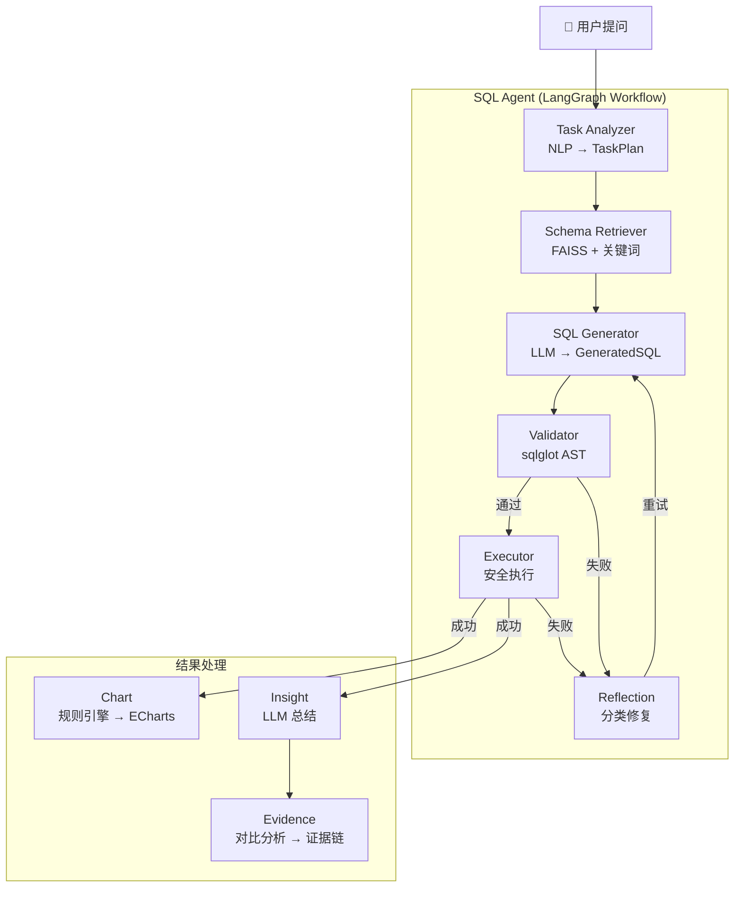

# AI Data Analyst

智能数据分析 Agent — 用自然语言提问，自动完成 SQL 生成、执行、可视化和业务洞察。



## Features

- **自然语言 → SQL** — 输入中文问题，自动生成 MySQL SELECT
- **智能 Schema 检索** — FAISS 向量检索 + 关键词匹配，非全量 Schema
- **结构化错误修复** — Error Classifier 分类处理，最多 3 次重试
- **多层安全防护** — sqlglot AST 校验 + MySQL 只读用户 + 运行时超时
- **可视化** — 规则引擎自动选择图表（Line / Bar / Pie / Scatter / Histogram）
- **业务洞察** — LLM 总结查询结果
- **证据链分析** — 对比分析 + 明确局限性
- **全链路可观测** — Trace ID 串联 + JSON 结构化日志
- **评测框架** — Golden SQL Benchmark（4 维度评分）

## Architecture

```
┌─────────────┐
│  Repository  │  数据访问层 — Schema / MySQL
├─────────────┤
│    Tool     │  执行动作 — Validator / Executor / Chart / Insight / Evidence
├─────────────┤
│   Service   │  LLM 调用 — TaskAnalyzer
├─────────────┤
│    Agent    │  有状态 Workflow — LangGraph StateGraph
└─────────────┘
```

| 模块 | 职责 |
|------|------|
| **Task Analyzer** | 理解用户意图 → `TaskPlan(task_type, metrics, dimensions)` |
| **Schema Retriever** | FAISS 语义检索 + 关键词 + FK 扩展 → `SchemaContext` |
| **SQL Generator** | 根据 Schema 生成 MySQL SELECT |
| **Validator** | sqlglot AST 静态分析，阻断写入和危险模式 |
| **Executor** | 只读用户执行，超时 10s，限 500 行 |
| **Reflection** | Error Classifier → Schema Error / Syntax Error / Ambiguous 分类处理 |
| **Chart** | 特征分析 → 规则引擎 → ECharts Option |
| **Insight** | QueryResult → LLM → 业务总结 |
| **Evidence** | 双结果对比 → 证据链 → 明确数据局限 |

## Quick Start（5 分钟）

### 前置条件

- Docker & Docker Compose
- LLM API Key（[DeepSeek](https://platform.deepseek.com) / OpenAI）

### 步骤

```bash
# 1. 克隆
git clone https://github.com/yaox2689-max/t2sAnalysis.git
cd t2sAnalysis

# 2. 配置环境变量
cp backend/.env.example backend/.env
# 编辑 backend/.env，填入 LLM_API_KEY=
# 默认使用 DeepSeek，切换 OpenAI 改 LLM_BASE_URL 和 LLM_MODEL 即可

# 3. 启动（自动初始化 MySQL + 构建 FAISS 索引）
docker compose up --build

# 4. 打开浏览器
open http://localhost:5173
```

启动后自动完成：
1. MySQL 初始化（Olist 电商数据集，8 张表）
2. FAISS Schema 索引构建
3. Backend API（`:8000`）
4. Frontend 开发服务器（`:5173`）

### 验证

```bash
curl http://localhost:8000/health
# → {"status": "ok"}
```

## Project Structure

```
├── backend/
│   ├── agents/              Workflow 节点
│   │   ├── reflection.py    Error Classifier + 修复策略
│   │   ├── sql_generator.py LLM → SQL
│   │   └── state.py         AgentState 统一 Context
│   ├── core/                基础设施
│   │   ├── config.py        Pydantic Settings
│   │   ├── database.py      异步 MySQL
│   │   ├── logging.py       JSON 结构化日志
│   │   ├── prompt_loader.py 统一 Prompt 管理
│   │   ├── redis.py         会话缓存
│   │   └── tracing.py       Trace ID + 节点计时
│   ├── graph/               LangGraph StateGraph
│   │   ├── graph.py         图编排（＜100 行）
│   │   ├── nodes.py         6 个薄节点
│   │   └── routers.py       3 个条件路由
│   ├── models/              Pydantic 契约
│   │   ├── query.py         QueryResult
│   │   └── task.py          TaskPlan / SchemaContext / GeneratedSQL
│   ├── repositories/        数据访问
│   ├── schemas/             Schema 索引与检索
│   │   ├── schema_index.py  FAISS 索引
│   │   └── schema_retriever.py 双路召回
│   ├── services/            业务逻辑
│   │   └── task_analyzer.py NLP → TaskPlan
│   └── tools/               工具函数（非 Agent）
│       ├── chart.py         规则引擎 → ECharts
│       ├── evidence_analyzer.py 证据链分析
│       ├── insight.py       LLM 总结
│       ├── sql_executor.py  安全执行
│       └── sql_validator.py  AST 校验
├── evaluation/              评测体系
│   ├── dataset.json         10 条 Golden 测试用例
│   ├── benchmark.py         CLI 入口
│   ├── metrics.py           4 维度评分
│   └── runner.py            评测运行器
├── frontend/                React + Ant Design + ECharts
├── prompts/                 统一 Prompt 目录
│   ├── reflection/
│   ├── sql_agent/
│   └── tools/
├── docker-compose.yml       开发
└── docker-compose.prod.yml  生产（Nginx :80）
```

## Configuration

核心环境变量（`backend/.env`）：

| 变量 | 必填 | 默认值 | 说明 |
|------|------|--------|------|
| `LLM_API_KEY` | ✅ | — | DeepSeek / OpenAI API Key |
| `LLM_MODEL` | — | `deepseek-chat` | 模型名称 |
| `LLM_BASE_URL` | — | `https://api.deepseek.com` | API 端点 |
| `SQL_TIMEOUT` | — | `10` | SQL 执行超时（秒） |
| `SQL_MAX_ROWS` | — | `500` | 最大返回行数 |

完整变量见 [`.env.example`](backend/.env.example)。

## Production Deployment

```bash
docker compose -f docker-compose.prod.yml up --build
```

生产模式使用 Nginx 统一入口（`:80`），Frontend 为静态构建产物，Backend 为多阶段 Python 镜像。

## Evaluation

```bash
cd backend
python -m evaluation.benchmark
```

输出 4 维度评分 + 逐用例报告：

| 指标 | 说明 |
|------|------|
| Task Accuracy | TaskPlan 与预期匹配度 |
| SQL Executable | SQL 是否可执行 |
| SQL Valid | 是否通过 AST 校验 |
| Result Consistency | 结果列是否符合预期 |

## Tech Stack

| 层 | 技术 |
|---|------|
| Backend | FastAPI + Python 3.12 |
| Agent | LangGraph |
| LLM | DeepSeek / OpenAI |
| Database | MySQL 8.0 |
| Vector Index | FAISS（CPU） |
| Cache | Redis 7 |
| Frontend | React + Ant Design + ECharts |
| SQL Analysis | sqlglot |
| Logging | JSON + Trace ID |
| Evaluation | Golden SQL Benchmark |

## Development

```bash
# Backend（需本地 Python 3.12 + MySQL + Redis）
cd backend
pip install -r requirements.txt
uvicorn main:app --reload

# Frontend
cd frontend
npm install
npm run dev
```

## Architecture Principles

1. **Workflow 只编排不承载业务** — LangGraph 是 Glue Layer，每个 Node 仅读写 State
2. **Repository 不做 Embedding，Tool 不查数据库** — 分层职责不可跨越
3. **TaskPlan 是中心契约** — 下游模块只接收 TaskPlan + SchemaContext，不接触自然语言
4. **Prompt 统一管理** — 所有 Prompt 通过 `PromptLoader` 加载，支持缓存和变量替换

## FAQ

**Q: 支持哪些 LLM？**
A: 兼容 OpenAI API 格式的模型均可。默认 DeepSeek，修改 `LLM_BASE_URL` 和 `LLM_MODEL` 即可切换。

**Q: 需要 GPU 吗？**
A: 不需要。Schema 检索使用 CPU FAISS，LLM 调用远程 API。

**Q: 支持多轮对话吗？**
A: 基础支持。TaskAnalyzer 接收 `history` 参数。

**Q: 如何添加新的 Agent 节点？**
A: 1. 新增 Node 函数  →  2. `graph.py` 加 `add_node()` + `add_edge()`  →  3. 注入 `build_graph()`。

**Q: 如何切换 Embedding 模型？**
A: 实现 `EmbeddingProvider` 协议，注入 `SchemaIndex` 即可。无需修改其他代码。

## License

MIT
